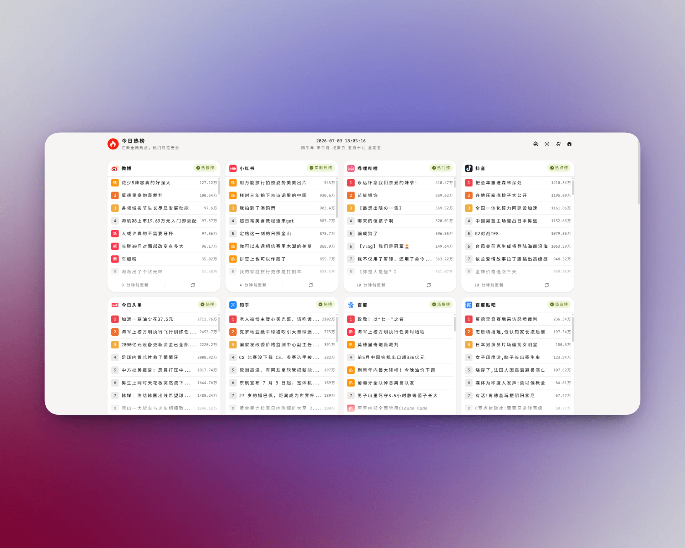

<div align="center">
  
  <h1>doroHot</h1>
  <p><em>自托管的全网热榜聚合站。在 <a href="https://github.com/baiwumm/next-daily-hot">baiwumm/next-daily-hot</a> 基础上做了移动端布局改版、AI 助手、服务端配置持久化、认证后台、MCP 接入与自建数据源等本地改造。</em></p>
  <p>汇聚全网热点资讯，实时掌握热门趋势</p>
</div>

- 上游项目：https://github.com/baiwumm/next-daily-hot
- 本仓库：doroHot（package 名 `dorohot`，当前版本 `v3.7.2`）

---

## 预览

<div align="center">
  
</div>

## 一、这是什么

一个**自托管**的热榜聚合站：把微博、知乎、B站、抖音、GitHub 等平台的榜单聚到一个页面里，按数据源卡片展示，支持导航跳转、明暗主题、移动端适配。

内置 AI 助手（对话 / 摘要 / 简报 / 分析），可把热榜定时推送到邮箱或**飞书 / 钉钉 / 企业微信**群机器人，并可**作为 MCP 服务端**供外部 AI 客户端接入。管理入口（设置、Cookies、后台）支持**账号密码登录**，首页保持公开。

本仓库基于上游 next-daily-hot 做了本地化改造，差异见「九、与上游的差异」。上游的原始版权与作者归属保持不变。

## 二、核心特性

### 1. 热榜聚合
- **36 个数据源**（本机版）：微博、知乎、B站、抖音、小红书、小黑盒、NGA·杂谈 / 手综、微博·关注流、澎湃、贴吧、腾讯新闻、虎扑、掘金、CSDN、36氪、豆瓣电影、微信读书、虎嗅、今日头条、百度、网易新闻、快手、懂车帝、历史今天、网易云音乐、夸克、人人都是产品经理、爱范儿、IT之家、东财快讯、金十数据、量子位、雷峰网·AI、HelloGithub、Github Trending 等。
- 每张卡片预览前 **8 条**（手机 5 条），"查看全部"打开弹层；条目含热度/标签，失败自动重试。
- 「历史今天」卡片就是「历史上的今天」全量列表。

### 2. 首页与导航（移动端改版）
- **桌面端 / 手机端各一套配置**（导航位置、排序、隐藏源），按 **768px** 断点自动选用，互不影响。
- 导航**四位置**：上 / 下 / 左 / 右。左右为**视口边缘悬浮图标轨**（桌面 hover 展开显示名称），不占内容宽度。
- 滚动时 Header 与导航自动收起，停止滚动恢复；源跳转条支持一键定位到对应卡片。
- 头部副标题为**当日日期**（公历 + 农历 + 星期），中央为**「历史上的今天」轮播**；页脚含「设置 / 共 N 个数据源 / 后台」入口与移动端今日日期。

### 3. AI 助手
- 入口：首页右下角**悬浮气泡**（不再是独立页面）。
- **AI 对话**：多会话、历史对话列表、重命名、置顶、编辑已发消息并重新生成、流式输出、复制；历史消息编辑区全宽、输入区右侧竖排「联网 / 发送」。
- **四项能力**：单条分析 / **生成摘要** / **每日简报** / **趋势分析**。
- **联网搜索**：Bing RSS（默认，无需 Key）、Google CSE、Exa、Firecrawl、Parallel、Tavily；聊天里开关为粘性。
- 对话可注入**站内实时榜单**并用联网结果**交叉验证**；回复按 Markdown 渲染（表格 / 链接 / 代码块）。
- 对话内 `/订阅 …` 命令直接配置邮件订阅。
- **多供应商管理**：可在「模型设置」中新增 / 切换 / **删除**供应商（删除当前供应商会自动回落到其余供应商），并支持读取可用模型、测试连接。

### 4. 邮件订阅
- 把选定热榜按 **每日 / 每周 / 每月** 定时推送到邮箱，可设时间窗口与内容范围，可选附带 **AI 分析**。

### 5. Cookies 管理
- 统一管理各站登录态：**微博 / B站 / 知乎**（本机版另含 **NGA / 小黑盒**），支持过期探测与快照。

### 6. 认证与后台管理（2026-10-01 新增）
- **单管理员用户名 + 密码**登录（密码 scrypt 加盐哈希，会话为 HMAC 签名的 httpOnly Cookie）。
- **首页公开**；`/admin`、`/settings`、`/cookies` 与写配置接口需登录。
- `/admin` 后台：运行概览 + 各管理入口 + 改密 / 退出 / **退出所有设备**。

### 7. MCP 接入（2026-10-01 新增）
- 把本站作为 **MCP 服务端**（Streamable HTTP，`POST /api/mcp`），供 Claude Desktop / Cursor / Claude Code 等客户端接入。
- **Bearer 令牌**认证（设置页生成 / 吊销 / 恢复 / 删除，服务端只存 sha256 哈希）。
- 9 个工具：热榜查询（`list_sources` / `get_hot_list`）、AI（`ai_summarize` / `ai_briefing` / `ai_analyze`）、`web_search`、`site_status`、订阅（`subscription_get` / `subscription_update`）；**每个工具可单独启用 / 停用**。

### 8. 远程接入 · 群机器人推送（2026-10-01 新增）
- 把热榜推送到 **飞书 / 钉钉 / 企业微信** 群机器人（自定义机器人 Webhook）。
- 支持飞书**签名校验**与钉钉**加签**；可「推送当前热榜」，也可勾选**随邮件订阅定时推送**。

### 9. 其它
- **历史上的今天**（顶部中央，可手动切换 / 查看全部）。
- 亮 / 暗主题；数字与热度使用自托管等宽字体。
- 首页配置与 AI 会话**保存在服务端**（`data/app-store.json`、`data/ai-chat.json`），多设备 / 刷新后保持。

## 三、技术栈

| 层 | 选型 |
|---|---|
| 框架 | Next.js 16.3（App Router，SSR） |
| UI | React 19 + HeroUI 3.2 |
| 样式 | Tailwind CSS v4 |
| 动画 | Motion（`motion/react`） |
| 状态 | Zustand |
| 请求 / 工具 | ahooks、dayjs、lunar-typescript（农历）、cheerio |

> 认证 / MCP / 群机器人推送均基于 Node 内置能力实现（`node:crypto` / `fetch`），**未新增第三方依赖**。

## 四、快速开始

```bash
pnpm install
pnpm dev            # http://localhost:3000
```

## 五、生产运行

生产模式跑 `next start`：

```bash
# 低内存机器必须给 Node 提上限，否则 build 会被 OOM kill
NODE_OPTIONS=--max-old-space-size=4096 pnpm build
pnpm start          # 默认 http://0.0.0.0:3000
```

若用 systemd / pm2 常驻，把 `pnpm start` 交给对应的进程管理器即可；本项目不依赖任何特定部署方式。

> 改了源码必须重新 `pnpm build`（页面与 `/api` 路由都是构建产物）。

## 六、配置

| 项 | 位置 | 说明 |
|---|---|---|
| 站点信息 | 项目内 `.env` | 站点名 / 描述 / 仓库地址 / 版权 / 统计 ID 等 |
| AI 模型与联网搜索 | **项目外** `model-config.json` | 供应商（可多份）、Base URL、API Key、默认模型、联网搜索源；Key 只存服务端 |
| 管理员账号 | 项目内 `data/auth.json` | 密码哈希 + 会话密钥（不进交付包 / 公开仓库） |
| MCP 令牌 | 项目内 `data/mcp.json` | 访问令牌哈希与能力开关 |
| 远程接入渠道 | 项目内 `data/channels.json` | 飞书 / 钉钉 / 企业微信 Webhook 与密钥 |
| 运行时数据 | 项目内 `data/*.json` | 首页配置、AI 会话、订阅、Cookies 等（不进交付包） |

可选环境变量：`DOROHOT_AUTH_FILE`、`DOROHOT_AUTH_SECRET`、`DOROHOT_AUTH_SECURE`、`DOROHOT_MCP_FILE`、`DOROHOT_CHANNELS_FILE`（详见 `.env` 注释）。

> 安全约定：**真实密钥一律放项目外**，绝不写进 `.env`（会被 git 跟踪 / 打进交付包）；`data/auth.json`、`data/mcp.json`、`data/channels.json` 均已加入 `.gitignore` 与打包器排除。

## 七、目录结构

```
src/
├─ app/            页面（首页 / login / admin / settings / cookies / AiModel …）与 api/* 路由（含 api/auth、api/mcp、api/channels）
├─ components/     组件（Header、HotCard、SourceNav、HotSettings、AiAssistant、Settings/*、Markdown、Footer…）
├─ enums/          数据源定义（HOT_ITEMS）
├─ hooks/          设备判定、导航自动隐藏等
├─ lib/            数据源抓取、AI、订阅、Cookies、认证（auth）、MCP（mcp-server）、群机器人（channels）、工具
├─ store/          Zustand（首页配置、AI 助手）
└─ styles/         ai.css / auth.css / mcp.css / fonts.css
public/            logo、数据源图标（images/）、字体、截图
data/              运行时数据（认证 / MCP / 渠道 / 首页配置 / 会话 / 订阅，不进交付包）
```

## 八、数据源一览（本机 36 个）

- **社交热榜**：微博、知乎、B站、抖音、小红书、快手、贴吧、虎扑、豆瓣电影、微信读书、网易云音乐、夸克
- **社区 / 关注流**：小黑盒、NGA·杂谈、NGA·手综、微博·关注流
- **新闻资讯**：澎湃、腾讯新闻、今日头条、百度、网易新闻、虎嗅、36氪、IT之家、爱范儿、人人都是产品经理
- **开发 / 科技**：稀土掘金、CSDN、HelloGithub、Github Trending、量子位、雷峰网·AI
- **财经快讯**：东财·快讯、金十数据
- **其它**：懂车帝、历史今天

## 九、与上游的差异（本 fork 改动）

1. **首页配置服务端化**：导航位置 / 排序 / 隐藏源从浏览器 local-state 迁到服务端，并**桌面端、手机端各存一套**，多设备共享、刷新保持。
2. **Cookies 登录**：新增 Cookies 管理页，支持 **微博 / 知乎 / 小黑盒 / B站 / NGA**（分发版保留微博 / B站 / 知乎）。
3. **AI 设置与 AI 助手**：新增 AI 配置页与首页悬浮助手，支持 **AI 对话**与问答，并能 **生成摘要 / 每日简报 / 趋势分析**；含联网搜索与 Markdown 渲染；供应商支持新增 / 切换 / 删除。
4. **邮件订阅**：热榜定时推送到邮箱（可选附 AI 分析）。
5. **移动端布局改版**：导航四位置（含左右悬浮轨）、源跳转条、卡片折叠预览、历史上的今天等。
6. **自建数据源**：微博关注流、东财快讯、金十数据、量子位、雷峰网·AI 等。
7. **认证与后台**：单管理员登录，首页公开、管理页与写配置接口需登录；`/admin` 提供概览与改密 / 会话管理。
8. **MCP 接入**：内置 MCP 服务端（Bearer 令牌、可逐项开关能力、9 个工具）。
9. **远程接入**：热榜可推送到飞书 / 钉钉 / 企业微信群机器人（含签名 / 加签）。

## 十、分发版说明

对外分发时由配套打包器处理（打包器不在本仓库内），会自动：

- **移除** NGA / 小黑盒 相关数据源与代码（分发版 **33 个**数据源）；
- **移除** dsh 等本机专有入口与代码；
- **清空**全部真实凭据（微博需自行导入 cookie 与 list_id），并**排除** `data/auth.json`、`data/mcp.json`、`data/channels.json` 等本机数据；
- **参数化**本机路径，并做**泄漏扫描**（含密钥形态 / 本机路径 / 项目名，命中即失败）。

分发版的首次部署说明见包内 `打包说明.md`（首次使用请访问 `/admin` 创建管理员）。

## 十一、许可与致谢

- 本项目 fork 自 [baiwumm/next-daily-hot](https://github.com/baiwumm/next-daily-hot)，遵循上游许可；原始版权与作者归属见上游仓库与 LICENSE。
- 如果 next-daily-hot 对你有帮助，欢迎给它一个 ⭐；如果本项目的改造对你有用，也同样欢迎支持。

> Made with ❤️ · © 2025-至今 doroHot
